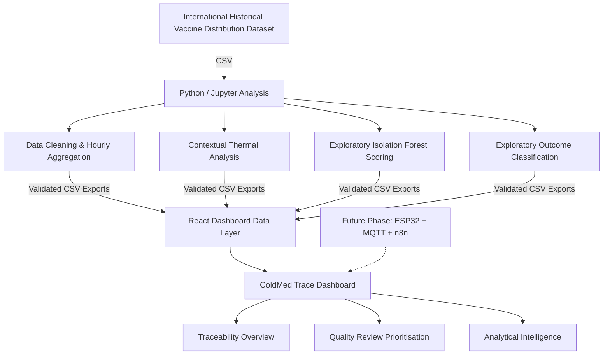

# 📦 ColdMed — Intelligent Cold Chain Traceability Platform

[](https://www.python.org/)
[](https://react.dev/)
[](https://vite.dev/)
[](https://tailwindcss.com/)
[](LICENSE)

**ColdMed Trace Souss** is an analytical prototype for vaccine cold-chain traceability and quality-review prioritisation. It uses an international historical vaccine distribution dataset to explore thermal behaviour, observed logistics outcomes, atypical thermal profiles, and decision-support visualisations.

---

## 🗺️ System Architecture

The pipeline detects atypical thermal profiles and explores signals associated with observed logistics outcomes, without automating any regulatory or quality decision. The historical dataset is analyzed and the resulting data layers are exported to feed the dashboard:



---

## 📂 Project Structure

```
ColdMed/
├── data/
│   └── input_data.csv                   # Raw international vaccine distribution telemetry
├── outputs/                             # Diagnostic and exploratory plots exported from python
├── notebookbae73f2aa6.ipynb             # Jupyter Notebook containing the core ML pipeline
├── coldmed-dashboard/                   # React + TypeScript Vite frontend dashboard
│   ├── public/
│   │   └── data/                        # CSVs exported from notebook consumed by the dashboard
│   ├── src/
│   │   ├── components/                  # Layout structures (Sidebar, Headers, etc.)
│   │   ├── context/                     # Global state manager (DataContext)
│   │   ├── pages/                       # Dashboard views (Overview, IoT, ML Intelligence)
│   │   └── services/                    # Client-side data parser and validator
│   ├── package.json
│   └── tsconfig.json
└── README.md                            # Repository main documentation
```

---

## 🔬 Jupyter Notebook Analysis & Modeling

The Jupyter Notebook ([notebookbae73f2aa6.ipynb](file:///Users/hafida/Downloads/ColdMed/notebookbae73f2aa6.ipynb)) implements the complete data science pipeline:

### 1. Data Cleaning & Preprocessing
*   **Audit**: Scans 26,674 rows of raw sensor telemetry for format mismatches and structural issues.
*   **Duplicate Control**: De-duplicates exact duplicate logs and resolves multiple conflicting records recorded within the same hour for a single batch.
*   **Datetime Parsing**: Normalizes heterogeneous timestamp formats safely using mixed parsing (Month/Day/Year vs Day/Month/Year).

### 2. Analytical Quality Triage
The notebook groups logs to build a **Batch Triage Summary** of 30 logical vaccine lots, evaluating:
*   **Temperature Excursion**: Hours spent out of safe thermal boundaries (above 8°C).
*   **Refrigeration vs. Ultra-low Exposure**: Accumulation of hours spent in specific storage environments.
*   **Expiration Signal**: Track of the time remaining before the batch expires.
*   **Final Observed Outcomes**: Lots are labeled into three logical outcomes:
    1.  `Livré au site de vaccination` (Delivered compliant)
    2.  `Écart explicite observé` (Explicit quality discard)
    3.  `Discordance à valider` (Mismatched telemetry requiring manual review)

### 3. Machine Learning Pipelines
*   **Unsupervised Anomaly Detection (`Isolation Forest`)**:
    *   Fitted on common logistics legs to identify thermal profiles that behave atypically compared to historical baselines for that storage category.
    *   Features used: Contextual temperature deviation from the median, hourly temperature range, and temperature change rate.
    *   Includes a **Contamination Sensitivity Simulation** (ranging from 1% to 10%) to audit the behavior of the Isolation Forest flags.
*   **Supervised Exploratory Classification**:
    *   Explores signals associated with observed logistics outcomes without automating any quality decision (using exploratory `Logistic Regression` and `Decision Tree Classifier` models).
    *   Evaluated using **Leave-One-Out Cross-Validation (LOOCV)** due to the cohort constraint ($N=27$ valid training lots).
    *   Outputs feature importance matrices (showing that out-of-bounds exposure and refrigeration hours are the strongest predictors).

---

## 💻 Interactive Admin Dashboard

The dashboard ([coldmed-dashboard](file:///Users/hafida/Downloads/ColdMed/coldmed-dashboard)) is a modern, responsive web application for pharmaceutical audit staff:

*   **Overview (Vue d'ensemble)**: Unified KPIs showing active counts, compliance alerts, and outcome breakdowns.
*   **Batch Surveillance & Detail**: Inventory table showing comprehensive shipment details, with interactive thermal timelines (Recharts) and detailed sensor logs.
*   **Quality Review Triage**: Dashboard to allow managers to investigate flagged lots with high/critical quality concerns (e.g. expiration or mismatch).
*   **Analytical Intelligence**: Displays ML graphs, including anomaly scores, sensitivity analysis curves, feature importance charts, and confusion matrices.
*   **IoT Extensions**: A real-time IoT simulation module streaming live mock temperature readings and tracking active connections.

---

## 🚀 Getting Started

### Running the Python Notebook

1.  Navigate to the repository root directory.
2.  Set up a Python virtual environment:
    ```bash
    python3 -m venv .venv
    source .venv/bin/activate
    ```
3.  Install dependencies:
    ```bash
    pip install pandas numpy scikit-learn matplotlib notebook openpyxl jupyter
    ```
4.  Launch Jupyter Notebook to view or re-run the pipeline:
    ```bash
    jupyter notebook notebookbae73f2aa6.ipynb
    ```

### Running the Dashboard Local Server

1.  Navigate into the dashboard directory:
    ```bash
    cd coldmed-dashboard
    ```
2.  Install dependencies:
    ```bash
    npm install
    ```
3.  Launch the development server:
    ```bash
    npm run dev
    ```
4.  Open `http://localhost:5173` in your browser.

---

## 🛡️ License

This project is licensed under the MIT License - see the LICENSE file for details.
